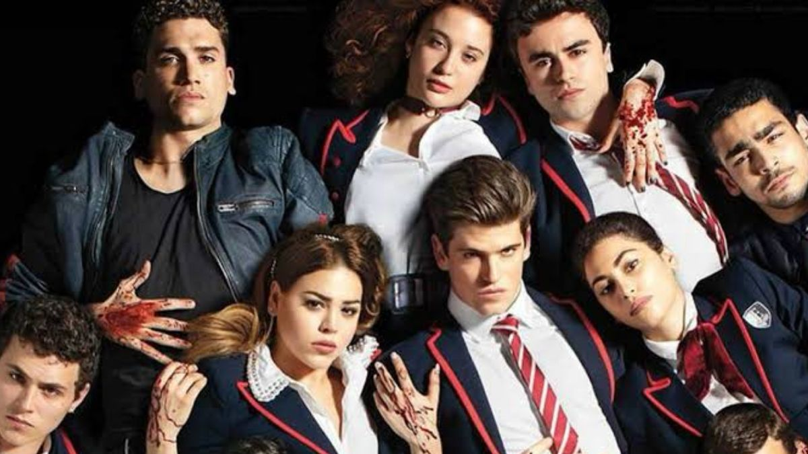
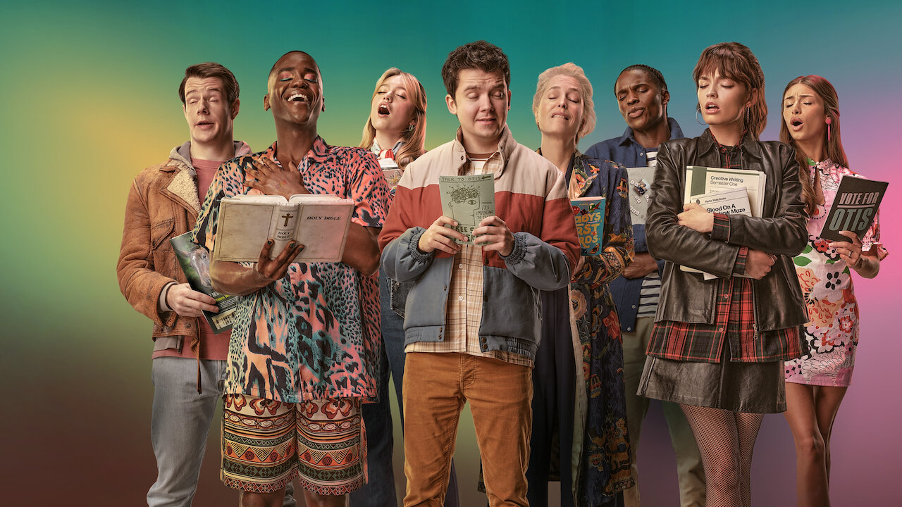
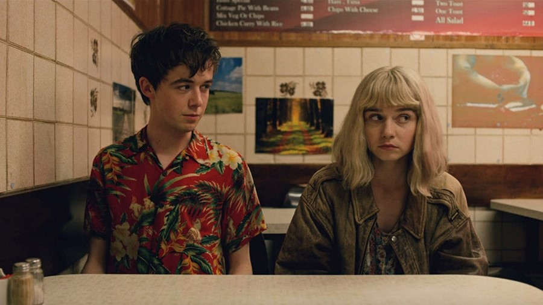
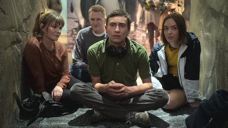

# app-dev
My first repository
## Favorite Series

- **Stranger Things**
  
  
  #### Set in the 1980s, the series centers around the residents of the fictional small town of Hawkins, Indiana, as they are plagued by a hostile alternate dimension known as the Upside Down, after a nearby human experimentation facility opens a gateway between it and the normal world.
- **Elite**
  
  
  #### Elite (Spanish: Élite) is a Spanish teen drama television series, created for Netflix by Carlos Montero and Darío Madrona. The series is set in Las Encinas, a fictional elite high school and revolves around the relationships between three working-class students enrolled at the school through a scholarship program and their wealthy classmates.
- **Sex Education**
  
  
  #### Sex Education is a British teen sex comedy drama television series created by Laurie Nunn for Netflix. It follows the lives of the teenagers and adults in the fictional town of Moordale as they contend with various personal dilemmas, often related to sexual intimacy
- **End of F*cking World**
  
 
#### Based on the award-winning comic book series by Charles Forsman, `The End of the F...ing World' sees two 17-year-old outsiders, James and Alyssa, embark on a road trip to find Alyssa's estranged father, who left home when she was just a child. 
- **Atypical**

 
#### Atypical is an American comedy-drama television series created by Robia Rashid for Netflix.[1] The series takes place in Connecticut, and focuses on the life of 18-year-old Samuel "Sam" Gardner (Keir Gilchrist), who is on the autism spectrum

## Favorite Movies

- Charlie and the Chocolate Factory
#### Charlie and the Chocolate Factory is a 2005 musical fantasy film directed by Tim Burton and written by John August, based on the 1964 British novel of the same name by Roald Dahl. The film stars Johnny Depp as Willy Wonka and Freddie Highmore as Charlie Bucket, alongside David Kelly, Helena Bonham Carter, Noah Taylor, Missi Pyle, James Fox, Deep Roy, and Christopher Lee. The storyline follows Charlie as he wins a contest along with four other children and is led by Wonka on a tour of his chocolate factory.
- Captain Phillips
#### Based on the 2009 Maersk Alabama hijacking, the film tells the story of the eponymous Captain Richard Phillips, an American merchant mariner who was taken hostage by Somali pirates. It stars Tom Hanks as Phillips, alongside Barkhad Abdi as pirate leader Abduwali Muse.
- Hacksaw Ridge
#### The film focuses on the World War II experiences of Desmond Doss, an American pacifist combat medic who, as a Seventh-day Adventist Christian, refused to carry or use a weapon or firearm of any kind. Doss became the first conscientious objector to be awarded the Medal of Honor, for service above and beyond the call of duty during the Battle of Okinawa. Andrew Garfield stars as Doss, with Sam Worthington, Luke Bracey, Teresa Palmer, Hugo Weaving, Rachel Griffiths, Vince Vaughn and Richard Pyros in supporting roles.

# I like to watch real life event and even documentaries.

